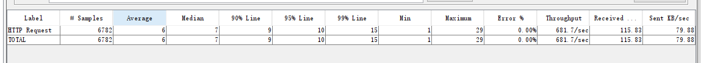
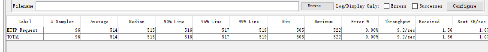
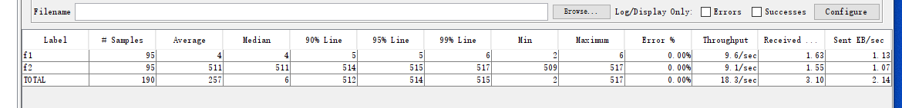
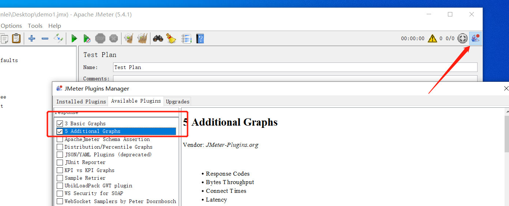
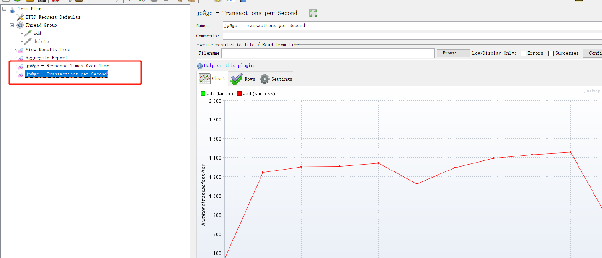
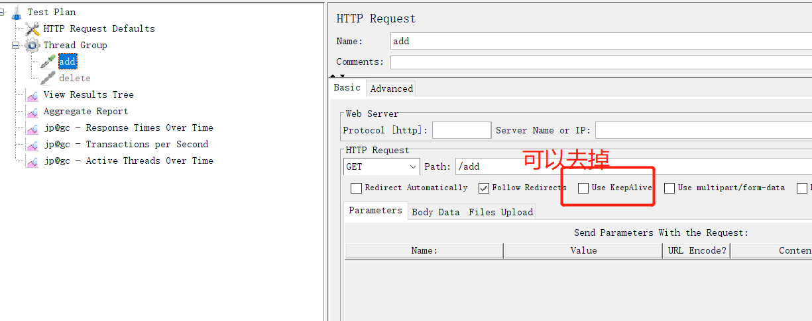
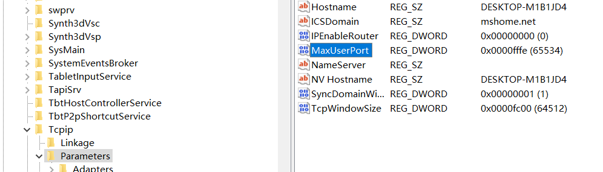

- [基础概念](#基础概念)
  - [多request相互之间的影响](#多request相互之间的影响)
- [常用命令](#常用命令)
- [插件](#插件)

# 基础概念

## 多request相互之间的影响

1. 先看单个request的情形(demo1/demo1.jmx)



> 10s总共完成了6782个请求，tps大致为6782/10，和图上基本一致。

2. 另外一个单个requst(demo1/demo2.jmx)



3. 合并后(demo1/demo3.jmx)



> 10s每个接口分别完成了95次请求，那么每个接口的tps大致为95/10，和图上基本一致，此时f2影响到了f1本身的性能表现(仅针对于tps受到了影响，rt响应时间并没有受到影响)

# 常用命令

```shell
-n：以非 GUI 模式运行 JMeter。
-t：指定要运行的 JMX 文件的路径。
-l：指定结果文件的路径。比如xxx.jtl日志

-j：指定 JMeter 日志文件的路径 比如jmeter.log日志
-r：以分布式模式运行 JMeter。
-D：定义系统属性。
-G：定义全局属性。
-H：指定代理服务器的主机名或 IP 地址。
-P：指定代理服务器的端口号。
-s：从结果文件中生成 HTML 报告。

-e：在测试运行后生成 HTML 报告。使用-e必须指定-l
-o //指定-e生成报告路径，会自动创建，即-e -o一般配合使用，并且必须指定-l参数
-f //强制删除日志文件，如果不指定，指定目录下如果不为空，则无法执行，注意不要指定为脚本路径，否则会把脚本文件也强制删除，删除的是-o指定的目录下的内容，不会删除-o目录
-g //指定jtl文件，一般配合-o参数使用，把jtl的日志转换为html格式的报告


# -J参数是用来设置JMeter属性的命令行参数。可以使用该参数将属性值传递给JMeter，并在测试执行期间使用这些属性。
# 该参数的语法为：-J[propertyName]=[value]
# 其中，[propertyName]是属性名，[value]是属性值。
# 例如，要将线程数设置为1000，可以使用以下命令：
jmeter -Jthreads=1000 -n -t test.jmx
# 在JMX文件中，可以使用${__P(propertyName)}函数来引用属性值。
# 例如，在Thread Group中将线程数设置为属性threads的值，可以使用以下方式：
# Number of Threads: ${__P(threads)}
```


# 插件

1. [jmeter-plugins-manager](https://jmeter-plugins.org/install/Install/)
2. 报告类插件





# 常见问题

## java.net.BindException

原因:  

windows为TCP/IP服务预留临时端口，Jmeter在跑并发测试的时候每开启一个线程（new socket操作）就会占用一个临时端口，若TCP/IP端口被占完了，而且没有及时释放（socket.close()操作不能立即释放绑定的端口，而是把端口设置为TIME_WAIT状态，过段时间才会真正释放，默认是240s），就会出现Java.net.BindException: Address already in use: connect这种情况。

解决:  

jmeter脚本本身:



windows操作系统配置:

1. 找到注册表
`HKEY_LOCAL_MACHINE\SYSTEM\CurrentControlSet\Services\Tcpip\Parameters`
2. 找到或创建一个DWORD，名为MaxUserPort的键，值为65534(十进制)
3. 重启电脑



## 命令行执行脚本jtl无法查看请求数据

```ini
#修改user.properties
jmeter.save.saveservice.output_format=xml
jmeter.save.saveservice.response_data=true
jmeter.save.saveservice.samplerData=true
jmeter.save.saveservice.requestHeaders=true
jmeter.save.saveservice.url=true
jmeter.save.saveservice.responseHeaders=true

#修改jmeter.properties
jmeter.save.saveservice.response_data=true
jmeter.save.saveservice.samplerData=true
```

注意，一般不要修改jmeter的这两个配置文件，因为对jmeter本身压测的性能可能造成影响。可以在调试时打开，真正压测时关闭