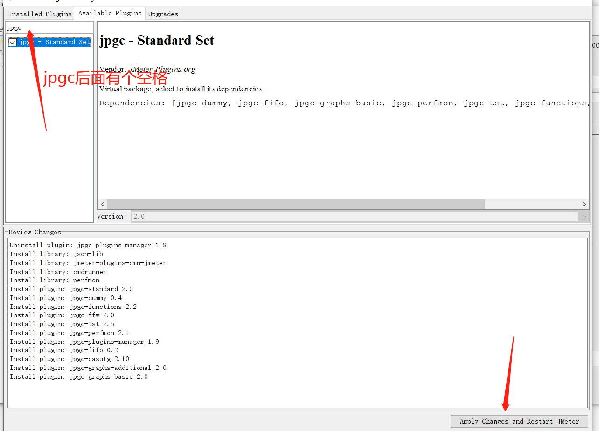

- [基础概念](#基础概念)
  - [多request相互之间的影响](#多request相互之间的影响)
- [常用命令](#常用命令)
- [代码](#代码)
- [插件](#插件)
- [常见问题](#常见问题)
  - [安装jdk后，没有jre目录](#安装jdk后没有jre目录)
  - [java.net.BindException](#javanetbindexception)
  - [Unsupported class file major version](#unsupported-class-file-major-version)
  - [命令行执行脚本jtl无法查看请求数据](#命令行执行脚本jtl无法查看请求数据)

# 基础概念

## 多request相互之间的影响

1. 先看单个request的情形(demo1/demo1.jmx)


> 10s总共完成了6782个请求，tps大致为6782/10，和图上基本一致。

2. 另外一个单个requst(demo1/demo2.jmx)


3. 合并后(demo1/demo3.jmx)


> 10s每个接口分别完成了95次请求，那么每个接口的tps大致为95/10，和图上基本一致，此时f2影响到了f1本身的性能表现(仅针对于tps受到了影响，rt响应时间并没有受到影响)

# 常用命令

```shell
-n：以非 GUI 模式运行 JMeter。
-t：指定要运行的 JMX 文件的路径。
-l：指定结果文件的路径。比如xxx.jtl日志

-j：指定 JMeter 日志文件的路径 比如jmeter.log日志
-r：以分布式模式运行 JMeter。
-D：定义系统属性。
-G：定义全局属性。
-H：指定代理服务器的主机名或 IP 地址。
-P：指定代理服务器的端口号。
-s：从结果文件中生成 HTML 报告。

-e：在测试运行后生成 HTML 报告。使用-e必须指定-l
-o //指定-e生成报告路径，会自动创建，即-e -o一般配合使用，并且必须指定-l参数
-f //强制删除日志文件，如果不指定，指定目录下如果不为空，则无法执行，注意不要指定为脚本路径，否则会把脚本文件也强制删除，删除的是-o指定的目录下的内容，不会删除-o目录
-g //指定jtl文件，一般配合-o参数使用，把jtl的日志转换为html格式的报告


# -J参数是用来设置JMeter属性的命令行参数。可以使用该参数将属性值传递给JMeter，并在测试执行期间使用这些属性。
# 该参数的语法为：-J[propertyName]=[value]
# 其中，[propertyName]是属性名，[value]是属性值。
# 例如，要将线程数设置为1000，可以使用以下命令：
jmeter -Jthreads=1000 -n -t test.jmx
# 在JMX文件中，可以使用${__P(propertyName)}函数来引用属性值。
# 例如，在Thread Group中将线程数设置为属性threads的值，可以使用以下方式：
# Number of Threads: ${__P(threads)}
```

# 代码

```groovy
命令行参数(
    -Jvar=1  ${__P(var, 2)}
    -n -t app.jmx -l log.jtl
)
内置函数()
内置变量(
    vars.get(name) 只能在线程组内共享，建议优先使用vars，再考虑props
    vars.put(name, val)
    props.get(name) 可以跨线程，建议通过-J、csv、自定义变量等模式变量使用vars
    props.put(name, val)
)
常用元件(
    User Defined Variables
    Http Request Defaults
    Http Header Manager
)
插件管理(
  jmeter-plugins-manager
)
脚本代码(
    Jmeter从3.1开始使用groovy作为默认的脚本，且内置了groovy引擎
    HeaderManager
    Header
    DigestUtils(md5)
)
```

```groovy
// 请求头处理
import org.apache.jmeter.protocol.http.control.HeaderManager;
import org.apache.jmeter.protocol.http.control.Header;
import org.apache.commons.codec.digest.DigestUtils;

HeaderManager headerManager = sampler.getHeaderManager();
// 另外在preprocess处理里面需要对headerManager进行单独处理，否则可能导致每个接口的headers在无限递增
if (headerManager == null) {
  headerManager = new HeaderManager();
}
if (headerManager.size() > 0) {
  headerManager.clear();
}

String[] headers = headerManager.getHeaders();
log.info("header length: " + headers.length);
for(String header : headers) {
    log.info(header);
}

// 当前时间戳
String timestamp = System.currentTimeMillis();
log.info("timestamp: " + timestamp);

// 获取变量
String sessionId = vars.get("sessionId");
String signature = sessionId + timestamp + "test";
log.info(signature);
// MD5加密
signature = DigestUtils.md5Hex(signature).toUpperCase();
log.info(signature);

// 增加请求头信息
headerManager.add(new Header("signature", signature));
headerManager.add(new Header("timestamp", timestamp)); 
// 最后需要把header增加到当前请求里面
sampler.setHeaderManager(headers);

// md5加密
// 一般md5加密会把请求数据也作为加密字符串传入，所以需要特殊处理
import org.apache.jmeter.protocol.http.control.HeaderManager;
import org.apache.jmeter.protocol.http.control.Header;
import org.apache.commons.codec.digest.DigestUtils;

// 如果这里不处理为字符串格式，需要在http request的请求头里面把json设置为字符串格式，不要使用json格式化后的样式了
def reqBody = "{\"id\":\"\",\"classifyName\":\"林磊测试\"}";
vars.put("reqBody", reqBody);

HeaderManager headerManager = sampler.getHeaderManager();
String timestamp = System.currentTimeMillis();
String sessionId = vars.get("sessionId");

// 这里使用了md5把请求数据加密
// 上面的reqBody是一个json字符串，注意针对json里面的"需要使用\转义
// http request的body data里面就可以直接使用${reqBody}
// 如果对中文有限制，需要在http request的Content Encoding配置UTF-8
String signature = sessionId + timestamp + reqBody + "xxx";
signature = DigestUtils.md5Hex(signature).toUpperCase();
headerManager.add(new Header("signature", signature));
headerManager.add(new Header("timestamp", timestamp)); 


// 随机字符
import org.apache.commons.lang3.RandomStringUtils

// 中文
def chinese = RandomStringUtils.random(5, 0x4e00, 0x9fa5, false, false);
println chinese

// 随机字符，不包含数字
def english = RandomStringUtils.randomAlphabetic(10)
println english

// 随机字符，包含数字
String charset = (('A'..'Z') + ('0'..'9') + ('a'..'z')).join();
String randomString = RandomStringUtils.random(10, charset.toCharArray());
println randomString

// 随机字符，包含数字
def randomString2 = RandomStringUtils.random(10, true, true)
println randomString2Locust
```

# 插件

1. [jmeter-plugins-manager](https://jmeter-plugins.org/install/Install/)
2. 报告类插件





# 常见问题

## 安装jdk后，没有jre目录

进入jdk安装目录后执行如下命令:

```shell
bin\jlink.exe --module-path jmods --add-modules java.desktop --output jre
```

## java.net.BindException

原因:  

windows为TCP/IP服务预留临时端口，Jmeter在跑并发测试的时候每开启一个线程（new socket操作）就会占用一个临时端口，若TCP/IP端口被占完了，而且没有及时释放（socket.close()操作不能立即释放绑定的端口，而是把端口设置为TIME_WAIT状态，过段时间才会真正释放，默认是240s），就会出现Java.net.BindException: Address already in use: connect这种情况。

解决:  

jmeter脚本本身:


windows操作系统配置:

1. 找到注册表
`HKEY_LOCAL_MACHINE\SYSTEM\CurrentControlSet\Services\Tcpip\Parameters`
2. 找到或创建一个DWORD，名为MaxUserPort的键，值为65534(十进制)
3. 重启电脑


## Unsupported class file major version

这个错误通常是由于Groovy不支持Java 16或更高版本的类文件major version 62而导致的。你需要将Java版本降级为15或更低版本，并确保你的项目使用的Groovy版本与所选的Java版本兼容。

JMeter 5.4.1支持Java 8, 9, 10, 11和12，它不支持Java 16。如果你正在使用Java 16，则需要降级到支持的版本之一才能使用JMeter 5.4.1

自JMeter版本3.1以来，Groovy已成为JMeter的默认脚本语言

## 命令行执行脚本jtl无法查看请求数据

```ini
#修改user.properties
jmeter.save.saveservice.output_format=xml
jmeter.save.saveservice.response_data=true
jmeter.save.saveservice.samplerData=true
jmeter.save.saveservice.requestHeaders=true
jmeter.save.saveservice.url=true
jmeter.save.saveservice.responseHeaders=true

#修改jmeter.properties
jmeter.save.saveservice.response_data=true
jmeter.save.saveservice.samplerData=true
```

注意，一般不要修改jmeter的这两个配置文件，因为对jmeter本身压测的性能可能造成影响。可以在调试时打开，真正压测时关闭